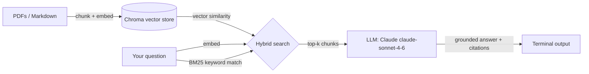

# notes-qa

A small RAG (Retrieval-Augmented Generation) tool that lets you ask questions
over your own PDFs and Markdown notes — answers come back grounded in your
actual documents, with citations back to the source file and page/section.

No more scrolling through 40 PDFs looking for the one paragraph you
half-remember. Point `notes-qa` at a folder, ask a question, get an answer
with receipts.

## Why

Generic chatbots don't know what's in your notes. `notes-qa` builds a local,
searchable index of your own documents and only answers from what it finds
there — if nothing relevant turns up (or similarity falls below the relevance
threshold), it says so instead of making something up.

## How it works



1. **Ingest** — recursively scans a folder, splits documents into overlapping
   chunks (~500 tokens with ~50 token overlap), embeds each chunk using
   `sentence-transformers` (`all-MiniLM-L6-v2`), and stores it in a local Chroma
   vector database along with source file, page (for PDFs), and heading (for Markdown).
2. **Retrieve (Hybrid Search)** — embeds your question and runs a hybrid ranker
   combining vector cosine similarity (70%) with BM25 keyword matching (30%) so
   exact terms, code identifiers, and acronyms aren't missed. Irrelevant queries
   are cleanly filtered by distance threshold.
3. **Generate** — formats the top retrieved excerpts into a strictly grounded
   prompt for Claude (`claude-sonnet-4-6`) requiring inline citations (e.g.
   `[doc.pdf, p. 12]` or `[notes.md, "Section"]`) and a summarized Sources list.

## Install

```bash
git clone https://github.com/Sege-Peter/Notes-QA.git
cd Notes-QA
python -m venv .venv
# On Linux/macOS:
source .venv/bin/activate
# On Windows:
.venv\Scripts\activate

pip install -e .
cp .env.example .env # add your ANTHROPIC_API_KEY
```

Or using `uv`:

```bash
uv sync
```

## Usage

Build the index from a folder of notes:

```bash
notes-qa ingest ./my-notes
```

```
Scanning ./my-notes ...
Found 14 files (9 PDFs, 5 Markdown)
Chunked into 342 segments
Embedding... done in 12.4s
Stored in ./.db
```

Rebuild the index from scratch (e.g. after editing notes):

```bash
notes-qa ingest ./my-notes --rebuild
```

Ask a question:

```bash
notes-qa ask "What did I write about rate limiting?"
```

```
Answer:
You noted that token-bucket rate limiting is preferable to fixed windows
because it smooths bursty traffic without rejecting legitimate spikes
[rate-limiting-notes.md, "Token Bucket"]. You also flagged that Redis'
INCR + EXPIRE pattern is a common way to implement a simple fixed-window
limiter, but warned it can allow up to 2x the intended rate at window
boundaries [system-design.pdf, p. 12].

Sources:
  - rate-limiting-notes.md — "Token Bucket"
  - system-design.pdf — page 12
```

When no relevant notes match the query:

```bash
notes-qa ask "Who won the 1998 World Cup?"
```

```
Answer:
No relevant information found in your notes for this question.
```

### Launch Live Interactive Web UI

```bash
notes-qa ui
```

```
Starting notes-qa Live UI at http://127.0.0.1:8000 ...
```

Open **`http://localhost:8000`** in your browser to:
- Ingest local folders or drag-and-drop `.pdf` and `.md` files
- Ask questions with real-time markdown answers and highlighted inline citations
- Inspect context receipts, hybrid BM25 scores, and vector distances
- Configure models (`claude-sonnet-4-6`), Top-K, and API keys via the Settings modal

## Configuration

| Env var | Description | Default |
|---|---|---|
| `ANTHROPIC_API_KEY` | API key used for answer generation | required |
| `ANTHROPIC_MODEL` | Claude model for generation | `claude-sonnet-4-6` |
| `EMBEDDING_MODEL` | `local` (sentence-transformers / ONNX) or `openai` | `local` |
| `NOTES_QA_DB_PATH` | Where the vector store is persisted | `./.db` |
| `SIMILARITY_DISTANCE_THRESHOLD` | Cosine distance cutoff for relevance filtering | `0.85` |

## Project structure

```
notes-qa/
├── src/notes_qa/
│   ├── __init__.py
│   ├── config.py       # Configuration and env loading
│   ├── ingest.py       # PDF/Markdown parsing, chunking, and Chroma persistence
│   ├── retrieve.py     # Hybrid search (vector cosine similarity + BM25 keyword matching)
│   ├── generate.py     # Prompt construction + Claude API call with citations
│   └── cli.py          # `notes-qa ingest` and `notes-qa ask` commands
├── tests/
│   ├── __init__.py
│   ├── test_ingest.py
│   ├── test_retrieve.py
│   ├── test_generate.py
│   ├── test_cli.py
│   └── test_integration.py
├── .env.example
├── .gitignore
├── pyproject.toml
└── README.md
```

## Running tests

```bash
pytest
```

## Features & Roadmap

- [x] PDF (`pypdf`) page-level parsing + Markdown heading tracking
- [x] Semantic retrieval with inline citations
- [x] Hybrid search (vector cosine similarity + BM25 keyword rank fusion)
- [x] Relevance distance threshold cutoff to avoid hallucinations
- [x] Live Interactive Web UI (`notes-qa ui`) with drag-and-drop ingestion & receipts viewer
- [ ] Support for `.docx` and plain `.txt`

## License

MIT
