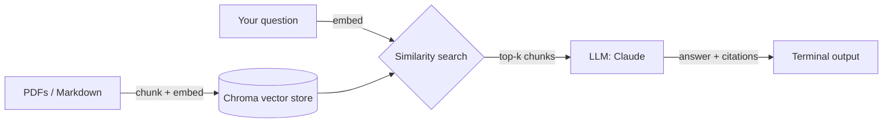

# notes-qa

A small RAG (Retrieval-Augmented Generation) tool that lets you ask questions
over your own PDFs and Markdown notes — answers come back grounded in your
actual documents, with citations back to the source file and page.

No more scrolling through 40 PDFs looking for the one paragraph you
half-remember. Point `notes-qa` at a folder, ask a question, get an answer
with receipts.

## Why

Generic chatbots don't know what's in your notes. `notes-qa` builds a local,
searchable index of your own documents and only answers from what it finds
there — if nothing relevant turns up, it says so instead of making something
up.

## How it works



1. **Ingest** — recursively scans a folder, splits documents into overlapping
   chunks (~500 tokens), embeds each chunk, and stores it in a local Chroma
   vector database along with its source file and page/heading.
2. **Retrieve** — embeds your question and pulls the most relevant chunks
   from the store.
3. **Generate** — passes those chunks to Claude with instructions to answer
   *only* from the provided context and cite its sources inline.

## Install

```bash
git clone https://github.com/Sege-Peter/notes-qa.git
cd notes-qa
uv sync              # or: pip install -e .
cp .env.example .env # add your ANTHROPIC_API_KEY
```

## Usage

Build the index from a folder of notes:

```bash
notes-qa ingest ./my-notes
```

```
Scanning ./my-notes ...
Found 14 files (9 PDFs, 5 Markdown)
Chunked into 342 segments
Embedding... done in 12.4s
Stored in ./notes-qa.db
```

Ask a question:

```bash
notes-qa ask "What did I write about rate limiting?"
```

```
Answer:
You noted that token-bucket rate limiting is preferable to fixed windows
because it smooths bursty traffic without rejecting legitimate spikes
[rate-limiting-notes.md, "Token Bucket"]. You also flagged that Redis'
INCR + EXPIRE pattern is a common way to implement a simple fixed-window
limiter, but warned it can allow up to 2x the intended rate at window
boundaries [system-design.pdf, p. 12].

Sources:
  - rate-limiting-notes.md — "Token Bucket"
  - system-design.pdf — page 12
```

Rebuild the index from scratch (e.g. after editing your notes):

```bash
notes-qa ingest ./my-notes --rebuild
```

## Configuration

| Env var | Description | Default |
|---|---|---|
| `ANTHROPIC_API_KEY` | API key used for answer generation | required |
| `EMBEDDING_MODEL` | `local` (sentence-transformers) or `openai` | `local` |
| `NOTES_QA_DB_PATH` | Where the vector store is persisted | `./notes-qa.db` |

## Project structure

```
notes-qa/
├── src/notes_qa/
│   ├── ingest.py     # load, chunk, embed, store documents
│   ├── retrieve.py   # similarity search over the vector store
│   ├── generate.py   # prompt construction + LLM call
│   └── cli.py         # `notes-qa ingest` / `notes-qa ask`
├── tests/
├── README.md
└── pyproject.toml
```

## Running tests

```bash
pytest
```

## Roadmap

- [x] PDF + Markdown ingestion
- [x] Semantic retrieval with citations
- [ ] Hybrid search (vector + keyword/BM25) for exact-term queries
- [ ] Support for `.docx` and plain `.txt`
- [ ] Web UI (Streamlit)

## License

MIT
