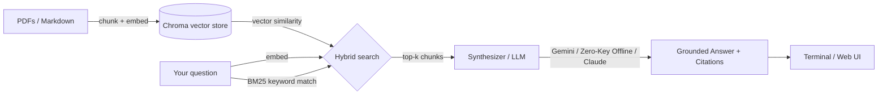

# notes-qa

A RAG (Retrieval-Augmented Generation) tool that lets you ask questions
over your own PDFs and Markdown notes — answers come back grounded in your
actual documents, with citations back to the source file and page/section.

Supports **Zero API Key Mode** (100% offline & free), **Google Gemini** (free tier API key), and **Anthropic Claude**.

No more scrolling through 40 PDFs looking for the one paragraph you
half-remember. Point `notes-qa` at a folder, ask a question, get an answer
with receipts.

## Why

Generic chatbots don't know what's in your notes. `notes-qa` builds a local,
searchable index of your own documents and only answers from what it finds
there — if nothing relevant turns up (or similarity falls below the relevance
threshold), it says so instead of making something up.

## How it works



1. **Ingest** — recursively scans a folder, splits documents into overlapping
   chunks (~500 tokens with ~50 token overlap), embeds each chunk using
   `sentence-transformers` (`all-MiniLM-L6-v2`), and stores it in a local Chroma
   vector database along with source file, page (for PDFs), and heading (for Markdown).
2. **Retrieve (Hybrid Search)** — embeds your question and runs a hybrid ranker
   combining vector cosine similarity (70%) with BM25 keyword matching (30%) so
   exact terms, code identifiers, and acronyms aren't missed. Irrelevant queries
   are cleanly filtered by distance threshold.
3. **Generate** — formats the top retrieved excerpts into a strictly grounded
   answer requiring inline citations (e.g. `[doc.pdf, p. 12]` or `[notes.md, "Section"]`)
   and a summarized Sources list.

---

## AI Providers & Generation Modes

`notes-qa` works out of the box with:

| Mode / Provider | Cost | Requirements | Description |
|---|---|---|---|
| **Zero API Key (Offline)** | **100% Free** | None | Built-in extractive grounded synthesizer running locally in Python (or local Ollama). No external API calls, 100% private. |
| **Google Gemini** | **Free tier** | `GEMINI_API_KEY` | High-quality answers using `gemini-2.5-flash` or `gemini-1.5-flash` with free keys from [Google AI Studio](https://aistudio.google.com/app/apikey). |
| **Anthropic Claude** | Pay-per-token | `ANTHROPIC_API_KEY` | High-reasoning generation using `claude-sonnet-4-6` or `claude-3-5-sonnet`. |

---

## Install

```bash
git clone https://github.com/Sege-Peter/Notes-QA.git
cd Notes-QA
python -m venv .venv

# On Linux/macOS:
source .venv/bin/activate
# On Windows:
.venv\Scripts\activate

pip install -e .
cp .env.example .env
```

Or using `uv`:

```bash
uv sync
```

---

## Usage

### 1. Build the index from a folder of notes

```bash
notes-qa ingest ./my-notes
```

```
Scanning ./my-notes ...
Found 14 files (9 PDFs, 5 Markdown)
Chunked into 342 segments
Embedding... done in 12.4s
Stored in ./.db
```

Rebuild index from scratch:

```bash
notes-qa ingest ./my-notes --rebuild
```

### 2. Ask a question

#### Zero API Key Mode (No Keys Required)
```bash
notes-qa ask "What did I write about rate limiting?" --provider offline
```

#### Google Gemini
```bash
notes-qa ask "What did I write about rate limiting?" --provider gemini
```

#### Auto Mode (uses configured key, or falls back to Zero-Key mode automatically)
```bash
notes-qa ask "What did I write about rate limiting?"
```

```
Answer:
Based on your notes:
- Token-bucket rate limiting is preferable to fixed windows because it smooths bursty traffic without rejecting legitimate spikes. [rate_limiting.md, "Token Bucket"]
- Tokens refill at a constant rate up to a bucket capacity. [rate_limiting.md, "Token Bucket"]
- Redis INCR + EXPIRE pattern is a common way to implement a simple fixed-window limiter, but warned it can allow up to 2x the intended rate at window boundaries. [rate_limiting.md, "Fixed Window Counter"]

Sources:
  - rate_limiting.md — "Token Bucket"
  - rate_limiting.md — "Fixed Window Counter"
```

When no relevant notes match the query:

```bash
notes-qa ask "Who won the 1998 World Cup?"
```

```
Answer:
No relevant information found in your notes for this question.
```

---

### 3. Launch Live Interactive Web UI

```bash
notes-qa ui
```

```
Starting notes-qa Live UI at http://127.0.0.1:8000 ...
```

Open **`http://localhost:8000`** in your browser to:
- Switch between **Zero API Key Mode**, **Google Gemini**, and **Claude** via Settings
- Ingest local folders or drag-and-drop `.pdf` and `.md` files
- Ask questions with real-time markdown answers and highlighted inline citations
- Inspect context receipts, hybrid BM25 scores, and vector distances

---

## Configuration

| Env var | Description | Default |
|---|---|---|
| `LLM_PROVIDER` | `auto`, `offline`, `gemini`, or `anthropic` | `auto` |
| `GEMINI_API_KEY` | Google Gemini API key (free at AI Studio) | optional |
| `GEMINI_MODEL` | Gemini model to use | `gemini-2.5-flash` |
| `ANTHROPIC_API_KEY` | Claude API key | optional |
| `ANTHROPIC_MODEL` | Claude model for generation | `claude-sonnet-4-6` |
| `EMBEDDING_MODEL` | `local` (sentence-transformers / ONNX) or `openai` | `local` |
| `NOTES_QA_DB_PATH` | Where the vector store is persisted | `./.db` |
| `SIMILARITY_DISTANCE_THRESHOLD` | Cosine distance cutoff for relevance filtering | `0.85` |

---

## Project Structure

```
notes-qa/
├── src/notes_qa/
│   ├── __init__.py
│   ├── config.py       # Configuration and env loading (Gemini, Claude, offline)
│   ├── ingest.py       # PDF/Markdown parsing, chunking, and Chroma persistence
│   ├── retrieve.py     # Hybrid search (vector cosine similarity + BM25 keyword matching)
│   ├── generate.py     # Multi-provider generation: Gemini, Zero-Key synthesizer, Claude
│   ├── server.py       # FastAPI live Web UI with provider switcher & receipts
│   └── cli.py          # Click CLI: `ingest`, `ask`, `ui`
├── tests/
│   ├── test_ingest.py
│   ├── test_retrieve.py
│   ├── test_generate.py
│   ├── test_cli.py
│   ├── test_server.py
│   └── test_integration.py
├── .env.example
├── pyproject.toml
└── README.md
```

---

## Running Tests

```bash
pytest
```

---

## Features

- [x] **Zero API Key Mode**: 100% offline extractive grounded synthesis with zero keys or costs
- [x] **Google Gemini Support**: Free tier via Google AI Studio (`gemini-2.5-flash`)
- [x] **Claude Support**: Reasoning via `claude-sonnet-4-6`
- [x] **Hybrid Search**: Vector cosine similarity + BM25 keyword rank fusion
- [x] **Inline Citations**: Every point links to `[file, page/section]`
- [x] **Live Interactive Web UI**: Single-page modern UI with receipt inspector and provider selector
- [x] **Anti-hallucination cutoff**: Answers are rejected when no documents exceed relevance threshold

---

## License

MIT
